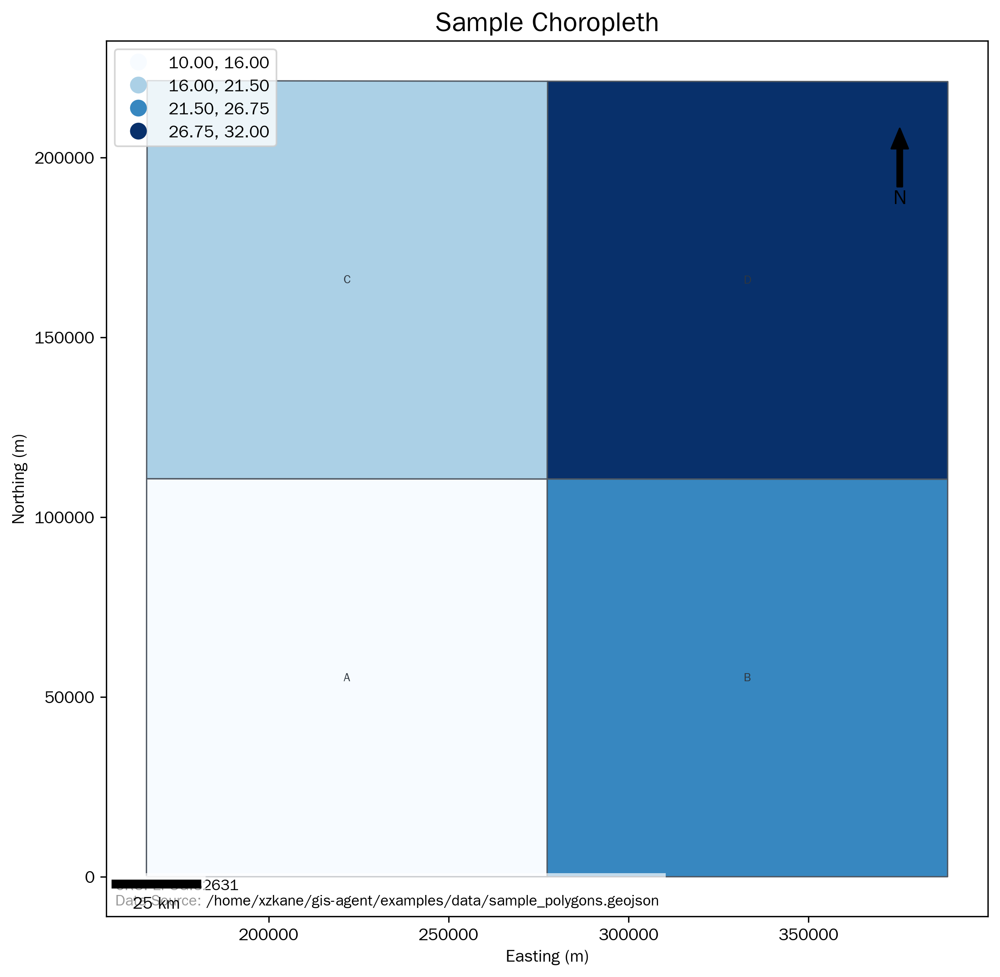
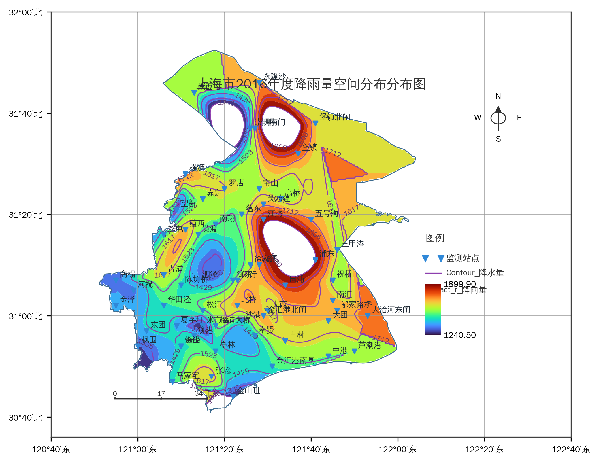

# TJSOES-GisAgent

`TJSOES-GisAgent` 是一个可部署的自然语言 GIS 制图引擎，支持命令行和 Web 页面两种使用方式。

项目采用“自然语言任务 -> 确定性工作流 -> 标准化 GIS 输出”的执行模式，避免让大模型直接自由生成不可控的地理处理代码。当前版本已经完成部署化改造，其他用户可以通过本地 Python 环境或 Docker 直接运行。

## 效果展示 (Gallery)

下面是使用本项目生成的专题图示例：

### 1. 分级设色图 (Choropleth Map)


### 2. 降雨量插值专题图 (Rainfall Map)


## 当前定位

- 自然语言任务 -> 结构化的工作流 JSON
- 采用确定性执行，而非自由形式的代码生成
- 支持针对多种 GIS 地图模板的任务感知与路由
- 旨在提供更接近 ArcGIS Pro 风格的地理处理体验
- 支持通过 Web UI 上传数据并直接生成地图

## 已实现功能

### 核心引擎 (Core engine)

- 支持混合数据源读取：矢量图层与表格文件
- 针对矢量工作流强制检查 CRS
- 在进行分析前自动修复无效几何图形
- 在投影分析前自动选择合适的分析 CRS
- 每次运行都会保存输出 `workflow_plan.json` 和 `execution_report.json`
- 提供 Web UI 封装，支持上传 Shapefile 组件、GeoJSON、GPKG、CSV、Excel

### 任务模板 (Task templates)

1. **降雨量 / 插值专题图**
   - 输入：`Excel/CSV 表格 + 面状边界图层`
   - 输出：插值降雨量表面、等值线、气象站分布点、经纬网、图例、比例尺、指北针
   - 路由策略：`rainfall_surface_map`

2. **分级设色图 (Choropleth map)**
   - 输入：包含数值字段的面状图层
   - 输出：分类的面状专题图
   - 路由策略：`choropleth_map`

3. **面内点汇总图 (Point-in-polygon summary map)**
   - 输入：点图层 + 面图层
   - 输出：完成空间聚合后的面状汇总图
   - 路由策略：`point_in_polygon_summary_map`

### 渲染行为 (Rendering behavior)

- 标准的面状地图渲染器
- 面向课程作业输出风格优化的精细降雨图渲染器
- 针对行政专题图的分级设色渲染器
- 支持将常规矢量图层输出为 Web 地图 (Web-map)

## 项目结构

```text
app.py
Dockerfile
docker-compose.yml
Makefile
src/gis_agent/
  cli.py
  planner.py
  engine.py
  runtime.py
  workflow.py
  webapp.py
  tool_registry.py
  llm.py
examples/
  create_sample_data.py
  render_shanghai_rainfall_refined.py
```

## 部署方式

### 方式 1: 本地 Python 部署

```bash
git clone <your-repo-url>
cd TJSOES-GisAgent
python3 -m venv .venv
source .venv/bin/activate
pip install --upgrade pip
pip install -e .
```

### 方式 2: Docker 部署

```bash
git clone <your-repo-url>
cd TJSOES-GisAgent
docker build -t tjsoes-gis-agent .
docker run --rm -p 8501:8501 tjsoes-gis-agent
```

### 方式 3: Docker Compose 一键启动

```bash
git clone <your-repo-url>
cd TJSOES-GisAgent
cp .env.example .env
docker compose up --build
```

启动后浏览器访问：

```text
http://localhost:8501
```

## 面向其他用户的交付方式

如果你要把这个项目交给别人直接用，建议采用下面的形式：

- `Docker Compose` 方式：最稳定，适合课程组、实验室或服务器部署
- `Web UI` 方式：最适合不会写命令行的用户
- `CLI` 方式：最适合批量任务和脚本化运行

推荐交付目录约定：

- `examples/`：只读示例数据
- `runs/`：真实任务输出目录
- `.env`：LLM 凭证和模型配置

## Web UI 产品化能力

当前页面已经支持：

- 任务输入、文件上传、执行按钮、结果清理
- 内置任务模板快捷填充
- 执行状态卡片和能力说明面板
- 地图结果预览
- `workflow_plan.json`、`execution_report.json`、结果图下载
- 最近任务历史展示
- 无交互启动，适合服务器部署

## 快速开始

```bash
cd /path/to/TJSOES-GisAgent
source .venv/bin/activate
python3 -m pip install -e .
python examples/create_sample_data.py
```

### Web 页面启动

```bash
source .venv/bin/activate
gis-agent-web
```

或者：

```bash
streamlit run app.py
```

或者使用 Makefile：

```bash
make install
make web
```

Web UI 支持：

- 上传 GeoJSON、Shapefile、GPKG、CSV、Excel
- 输入自然语言任务
- 自动生成 `workflow_plan.json`
- 执行 GIS 工作流并预览 `result.png` 或 `result.html`
- 展示执行报告 `execution_report.json`

### 命令行启动

```bash
source .venv/bin/activate
gis-agent --help
```

或者：

```bash
make cli
```

### 示例 1: 分级设色图

```bash
gis-agent \
  --task "用示例行政区数据按 value 字段生成分级设色专题图，标题为 Sample Choropleth" \
  --data examples/data/sample_polygons.geojson \
  --output-dir output/template_choropleth \
  --mode template \
  --run
```

### 示例 2: 面内点汇总专题图

```bash
gis-agent \
  --task "把示例点数据落入行政区后统计每个区的点数量并生成专题图，标题为 Sample Point Summary" \
  --data examples/data/sample_points.geojson examples/data/sample_polygons.geojson \
  --output-dir output/template_point_summary_v2 \
  --mode template \
  --run
```

### 示例 3: 降雨量专题图

```bash
gis-agent \
  --task "根据监测站位及降雨量 Excel 表和省界线 shp，一步生成上海市2016年度降雨量空间分布专题图，要求包含监测站点、等值线、降雨场插值、经纬网、图例、比例尺、图名" \
  --data "/path/to/监测站位及降雨量.xlsx" "/path/to/sjZJ.shp" \
  --output-dir output/algorithm_v2_demo3 \
  --mode template \
  --run
```

## 工作流输出

每个运行任务都会输出：

- `workflow_plan.json`：工作流执行计划
- `execution_report.json`：执行报告
- `result.png` 或 `result.html`：渲染结果图

针对一些特定的路由，还会自动导出派生的 GIS 过程数据。

## 环境变量

如果需要启用 LLM 规划模式，可在 `.env` 或 shell 中配置：

```bash
export OPENAI_API_KEY=...
export OPENAI_MODEL=gpt-4.1
export OPENAI_BASE_URL=https://your-compatible-endpoint/v1
```

Docker Compose 会自动读取 `.env`。

## 生产部署建议

- 优先使用 `docker compose up --build`
- 将 `runs/` 目录映射到宿主机，便于保存生成结果
- 如果对外网开放，建议在前面再加一层 Nginx / Caddy 反向代理
- 如果多人共用，后续应补用户隔离和任务队列

## 与 MapGPT Agent 的比较

### `MapGPT Agent` 的优势

- 从“输入 Prompt”到“输出图片”的体验更快
- 针对轻量级的地图制作演示有着更好的开箱即用体验
- 在输入数据已经准备完善的情况下，第一次尝试往往能得到视觉效果更好的地图

### `gis-agent` 的优势

- 确定性的工作流执行，而非无约束的代码生成
- 显式的任务路由控制
- 更容易测试和加固
- 更容易扩展为类似于 ArcGIS Pro 的地理处理模式
- 产生可审计的工作流和执行记录

### 实际区别

- `MapGPT Agent` 更像是一个基于自然语言的制图助手。
- `gis-agent` 更像是一个可控的 GIS 执行引擎。
- `gis-agent` 现在额外提供了可直接部署的 Web 页面，更适合交付给其他用户使用。

## 已知不足

- 目前还无法完全替代 ArcGIS Pro
- CRS 策略有所改进，但在涵盖所有地理尺度上仍不完善
- 布局质量受限于模板驱动，暂时缺乏完整的排版引擎
- 自动标签放置和防碰撞处理依然比较基础
- Web UI 当前适合单任务交互式使用，尚未加入用户权限、多任务队列和异步任务管理
- 依然缺乏更多的任务模板：
  - 核密度分析 (Kernel density)
  - 缓冲区分析图 (Buffer analysis maps)
  - 叠加分析图 (Overlay analysis maps)
  - 网络/可达性分析图 (Network / accessibility maps)

## 路线图 (Roadmap)

下一步工作设想：

1. 增加更多专题地图模板
2. 为 Web UI 增加任务历史、结果归档和批处理支持
3. 针对工作流路由和输出建立回归测试
4. 进一步提升标题提取和字段推断能力
5. 加入更强大的制图布局评分规则及预设样式

## 大语言模型 (LLM) 模式

依然支持兼容 OpenAI 接口的规划模式：

```bash
export OPENAI_API_KEY=...
export OPENAI_MODEL=gpt-4.1
export OPENAI_BASE_URL=https://your-compatible-endpoint/v1
```

在 `auto` 模式下，当检测到有效凭证时，引擎会使用 LLM 规划；否则将回退到模板规划模式。
